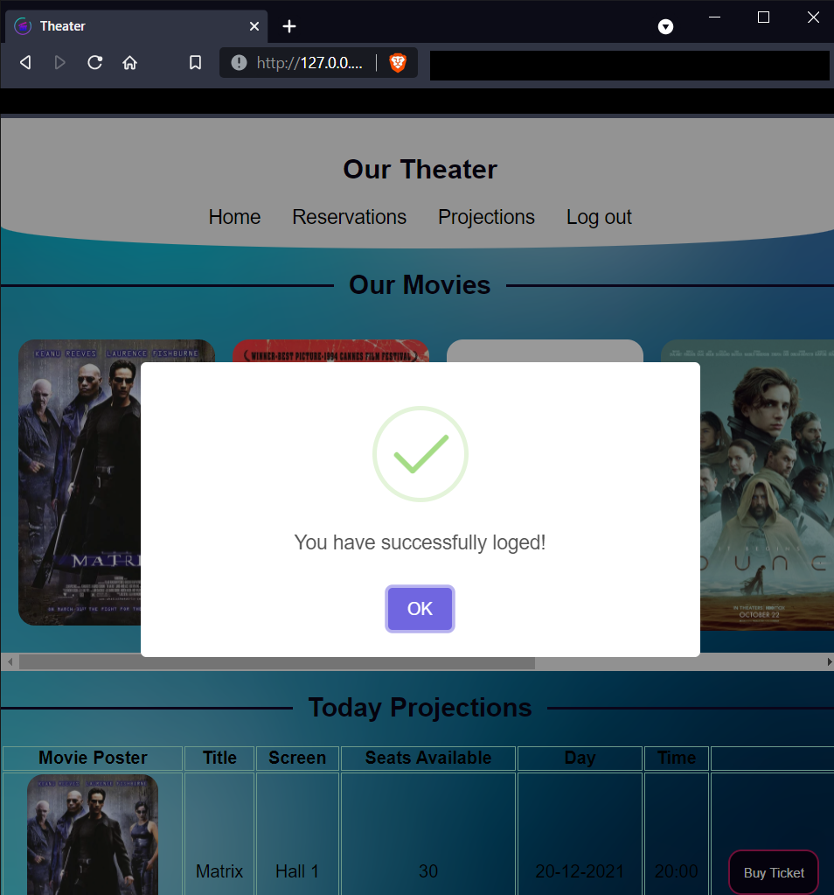
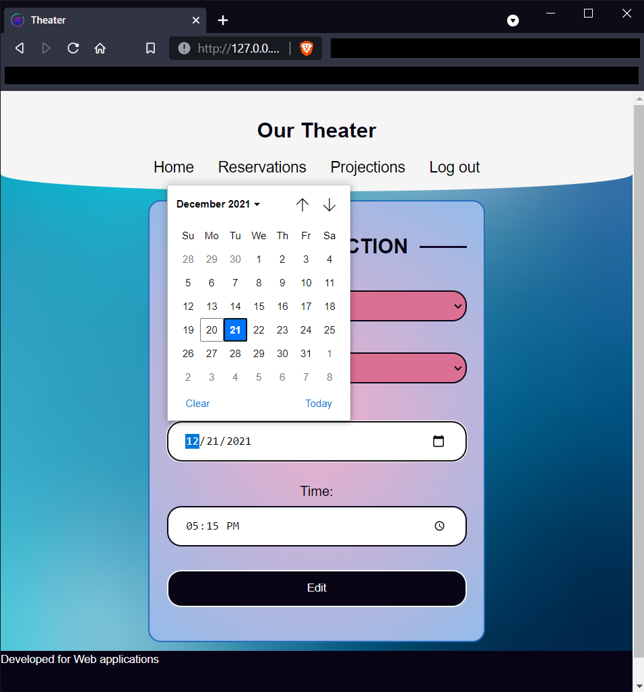

<h1 align="center">
   
  Theater Web App with Flask
</h1>
<h4 align="center">A theater management and ticket booking system</h5>

 

  
Table of Contents

  <ul>
    <li><a href="#project-description">Project Description</a></li>
    <li><a href="#theater-app-screenshots">Theater App Screenshots</a></li>
    <li><a href="#technology">Technology</a></li>
  </ul>

## Project Description
The Theater Web App is a complete theater management and ticket booking system, designed for both customers and administrators to manage movie listings, reservations, and transactions efficiently. Built using Python, Flask, and SQLAlchemy, this web-based application streamlines the booking process while providing admin features to manage showtimes and customer reservations.

The application offers a responsive and user-friendly interface for seamless interaction, whether it's browsing movies, booking tickets, or managing theater operations from the admin panel.

<h3>🔑 Key Features</h3>
<ul>
  <li><strong>User Registration & Login:</strong> Secure sign-up and login functionality.</li>
  <li><strong>Movie Listings:</strong> View available movies with detailed descriptions.</li>
  <li><strong>Online Ticket Booking:</strong> Book tickets for movies directly from the app.</li>
  <li><strong>Admin Dashboard:</strong> Add, edit, or delete movies and projections.</li>
  <li><strong>Manage Reservations:</strong> Admins can view and manage customer reservations.</li>
  <li><strong>Error & Info Alerts:</strong> Intuitive success, error, and info messages for better user experience.</li>
  <li><strong>Responsive Design:</strong> Accessible across devices with a responsive UI.</li>
</ul>

## Theater App Screenshots

<table>
  <tr>
    <th>Sign Up</th>
    <th>Login</th>
  </tr>
  <tr>
    <td></td>
    <td></td>
  </tr>
 </table>

<table>
  <tr>
    <th>Success</th>
    <th>Error</th>
    <th>Info</th>
  </tr>
  <tr>
    <td></td>
    <td></td>
    <td></td>
  </tr>
 </table>

<table>
  <tr>
    <th>Home</th>
  </tr>
  <tr>
    <td></td>
  </tr>
 </table>

<table>
  <tr>
    <th>Movie View</th>
    <th>Buy Ticket</th>
  </tr>
  <tr>
    <td></td>
    <td></td>
  </tr>
 </table>

<table>
  <tr>
    <th>Manager Reservations View</th>
    <th>Manager Edit View</th>
  </tr>
  <tr>
    <td></td>
    <td></td>
  </tr>
</table>

<table>
  <tr>
    <th>Add Projection</th>
    <th>Edit Projection</th>
  </tr>
  <tr>
    <td></td>
    <td></td>
  </tr>
</table>

## Technology
- Backend:
  * Python
  * Flask Framework
  * SQLAlchemy
- Fronted:
  * HTML
  * CSS
  * JavaScipt + JQuery + AJAX
